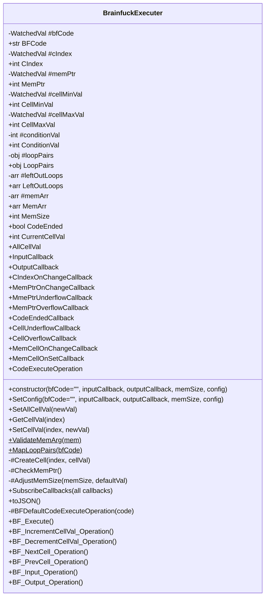
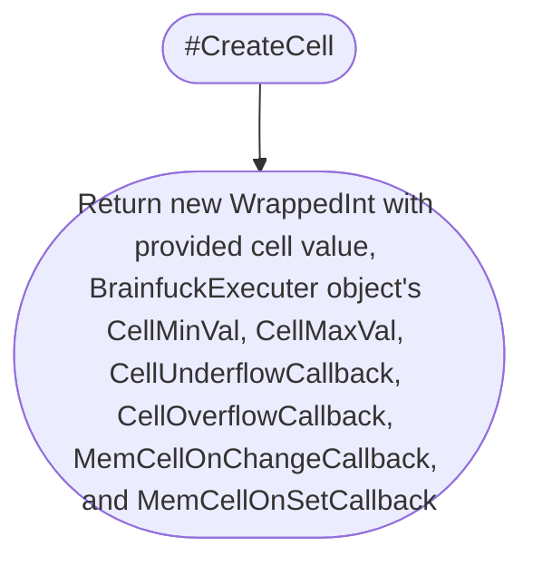
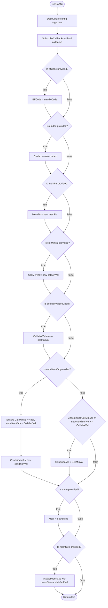

# [BrainfuckExecuter](/src/Executer/BrainfuckExecuter.js)

This class should and will only execute brainfuck. Can be interact with using callbacks.



## Private Properties

### #bfCode

* Private `WatchedVal` type string.
* Stores the brainfuck code to be, or already, executed.
* Default to empty string (`""`).
* When the value changes, *[`loop pairs`](#looppairs-1)* and *[`left-out loops`](#leftoutloops-1)* will be remaped.
* Changing this will **not** change the CIndex.
* Exposed by [`BFCode`](#bfcode-1) with getter and setter.

### #cIndex

* Private `WatchedVal` type integer.
* This index points to the current code to be executed.
* The value can be any integer, not limited within 0 and [`BFCode`](#bfcode).
* Default to 0.
* When the value changes, [`CIndexOnChangeCallback`](#cindexonchangecallback) will be called, and if it is larger or equal to [`BFCode`](#bfcode), [`CodeEndedCallback`](#codeendedcallback) will be called.
* Will be affected by [`BF_Execute`](#bf_execute), which is the return value of [`CodeExecuteOperation`](#codeexecuteoperation), if that callback is provided.
* Exposed by [`CIndex`](#cindex-1) with getter and setter.

### #memPtr

* Private `WatchedVal` type integer.
* This points to the current cell in [`#memArr`](#memarr).
* Limited by the [`MemSize`](#memsize).
* Default to 0.
* When the value changes, [`MemPtrOnChangeCallback`](#memptronchangecallback) will be called, and if it is underflowed (smaller than 0) or overflowed (larger or equal to [`MemSize`](#memsize)), [`MemPtrUnderflowCallback`](#mmeptrunderflowcallback) or [`MemPtrOverflowCallback`](#memptroverflowcallback) will be called respectively.
* Will be affected by [`BF_NextCell_Operation`](#bf_nextcell_operation) and [`BF_PrevCell_Operation`](#bf_prevcell_operation).
* Exposed by [`MemPtr`](#memptr-1) with getter and setter.

### #cellMinVal

* Private `WatchedVal` type integer.
* This is the min boundary of cells in [`#memArr`](#memarr) (inclusive).
* This property is for custom Brainfuck behaviour.
* Value is not limited, but must be smaller or equal to [`CellMaxVal`](#cellmaxval-1).
* Default to 0.
* When the value changes, the min of **all** cells in [`#memArr`](#memarr) will be changed, which might changes the value of each cell, and if the new value underflowed, overflowed, or changed, [`CellUnderflowCallback`](#cellunderflowcallback), [`CellOverflowCallback`](#celloverflowcallback), and [`MemCellOnChangeCallback`](#memcellonchangecallback) will be called respectively.
* This property, with [`#cellMaxVal`](#cellmaxval) are the only two that will affect every cells in [`#memArr`](#memarr).
* Brainfuck execution operations will not affect this property.
* Exposed by [`CellMinVal`](#cellminval-1) with getter and setter.

### #cellMaxVal

* Private `WatchedVal` type integer.
* This is the max boundary of cells in [`#memArr`](#memarr) (inclusive).
* This property is for custom Brainfuck behaviour.
* Value is not limited, but must be larger or equal to [`CellMinVal`](#cellminval-1).
* Default to 255.
* When the value changes, the max of **all** cells in [`#memArr`](#memarr) will be changed, which might changes the value of each cell, and if the new value underflowed, overflowed, or changed, [`CellUnderflowCallback`](#cellunderflowcallback), [`CellOverflowCallback`](#celloverflowcallback), and [`MemCellOnChangeCallback`](#memcellonchangecallback) will be called respectively.
* This property, with [`#cellMinVal`](#cellminval) are the only two that will affect every cells in [`#memArr`](#memarr).
* Brainfuck execution operations will not affect this property.
* Exposed by [`CellMaxVal`](#cellmaxval-1) with getter and setter.

### #conditionVal

* Private integer.
* This is the condition value, used in loop checking in [`#BFDefaultCodeExecuteOperation`](#bfdefaultcodeexecuteoperation).
* Default to 0.
* In [`SetConfig`](#setconfig), if conditionVal is not within [`CellMinVal`](#cellminval-1) and [`CellMaxVal`](#cellmaxval-1), and new conditionVal is not provided, it will set to [`CellMinVal`](#cellminval-1).
* The changing of this property will not affect anything, except how loop will behave in [`#BFDefaultCodeExecuteOperation`](#bfdefaultcodeexecuteoperation).
* Brainfuck execution operations will not affect this property.
* Exposed by [`ConditionVal`](#conditionval-1) with getter and setter.
* The reason I didn't throw error for out-of-range conditionVal is because it will increase the complexity when setting [`CellMinVal`](#cellminval-1) and [`CellMaxVal`](#cellmaxval-1).

### #loopPairs

* Private JavaScript object.
* This stores all pairs of *loop heads* (`[`) and *loop tails* (`]`) in [`BFCode`](#bfcode-1) by index (integer), which is where they jump to.
* Bi-directional.
* Default to empty.
* Can only be changed (re-mapped) when [`BFCode`](#bfcode-1) changes.
* The changing of this property will not affect anything, except how loop will behave in [`#BFDefaultCodeExecuteOperation`](#bfdefaultcodeexecuteoperation).
* Brainfuck execution operations will not affect this property.
* Exposed by [`LoopPairs`](#looppairs-1) with getter **only** (can't be setted).

### #leftOutLoops

* Private array of integers.
* This stores the index (integer) of all *loop heads* (`[`) and *loop tails* (`]`) without it's pair of *tail* and *head* respectively.
* Default to empty.
* Can only be changed (re-mapped) when [`BFCode`](#bfcode-1) changes.
* The changing of this property will not affect anything, this is not even used within the class.
* Brainfuck execution operations will not affect this property.
* Exposed by [`LeftOutLoops`](#leftoutloops-1) with getter **only** (can't be setted).

### #memArr

* Private array of `WrappedInt`.
* This is the memory, with all the cells.
* Default to empty, but will have at least one cell when object is constructed.

## Public Properties

### BFCode

* Get BFCode
    ```mermaid
    flowchart TD

    subgraph BrainfuckExecuter
        Start([Get BFCode])
    end

    subgraph WatchedVal
        End([Return #bfCode.Val])
    end

    Start
    -->
    End
    ```

* Set BFCode
    ```mermaid
    flowchart TD

    subgraph WatchedVal
        SetBFCode[#bfCode.Val = newVal]
        WatchedValCheckSameVal{originalVal === newVal}
    end

    subgraph BrainfuckExecuter
        Start([Set BFCode])
        EnsureString
        MapLoopPairs[mapResult = MapLoopPairs]
        SetLoopPairs[#loopPairs = mapResult.LoopPairs]
        SetLeftOutLoops[#leftOutLoops = mapResult.LeftOutLoops]
        End([End])
    end

    Start
    -->
    EnsureString
    -->
    SetBFCode
    -->
    WatchedValCheckSameVal
    --false-->
    MapLoopPairs
    -->
    SetLoopPairs
    -->
    SetLeftOutLoops
    -->
    End

    WatchedValCheckSameVal
    --true-->
    End
    ```

### CIndex

* Get CIndex
    ```mermaid
    flowchart TD

    subgraph BrainfuckExecuter
        Start([Get CIndex])
    end

    subgraph WatchedVal
        End([Return #cIndex.Val])
    end

    Start
    -->
    End
    ```

* Set CIndex
    ```mermaid
    flowchart TD

    subgraph WatchedVal
        SetCIndex[#cIndex.Val = newVal]
        WatchedValCheckSameVal{originalVal === newVal}
    end

    subgraph BrainfuckExecuter
        Start([Set CIndex])
        EnsureInt
        CIndexOnChangeCallback
        IsCodeEnded{CodeEnded === true}
        CodeEndedCallback
        End([End])
    end

    Start
    -->
    EnsureInt
    -->
    SetCIndex
    -->
    WatchedValCheckSameVal
    --false-->
    CIndexOnChangeCallback
    -->
    IsCodeEnded
    --true-->
    CodeEndedCallback
    -->
    End

    WatchedValCheckSameVal
    --true-->
    End

    IsCodeEnded
    --false-->
    End
    ```

### MemPtr

* Get MemPtr
    ```mermaid
    flowchart TD

    subgraph BrainfuckExecuter
        Start([Get MemPtr])
    end

    subgraph WatchedVal
        End([Return #memPtr.Val])
    end

    Start
    -->
    End
    ```

* Set MemPtr
    ```mermaid
    flowchart TD

    subgraph WatchedVal
        SetMemPtr[#memPtr.Val = newVal]
        WatchedValCheckSameVal{originalVal === newVal}
    end

    subgraph BrainfuckExecuter
        Start([Set MemPtr])
        EnsureInt
        MemPtrOnChangeCallback
        CheckMemPtr
        End([End])
    end

    Start
    -->
    EnsureInt
    -->
    SetMemPtr
    -->
    WatchedValCheckSameVal
    --false-->
    MemPtrOnChangeCallback
    -->
    CheckMemPtr
    -->
    End
    
    WatchedValCheckSameVal
    --true-->
    End
    ```

### CellMinVal

* Get CellMinVal
    ```mermaid
    flowchart TD

    subgraph BrainfuckExecuter
        Start([Get CellMinVal])
    end

    subgraph WatchedVal
        End([Return #cellMinVal.Val])
    end

    Start
    -->
    End
    ```

* Set CellMinVal
    ```mermaid
    flowchart TD

    subgraph WatchedVal
        SetCellMinVal[#cellMinVal.Val = newVal]
        WatchedValCheckSameVal{originalVal === newVal}
    end

    subgraph WrappedInt
        WrappedIntEnsureInt[Ensure newVal is int]
        WrappedIntEnsureIntValMinMax[Ensure all val, min, and max are int]
        WrappedIntEnsureMinMax1[EnsureMinMax]
        WrappedIntEnsureMinMax2[EnsureMinMax]
        SetIndCellMin[Cell.Min = newVal]
        CheckUnderflow[Flag val < min as underflow]
        CheckOverflow[Flag val > max as overflow]
        Wrap
        WasUnderflow{Was underflow}
        WasOverflow{Was overflow}
        WrappedIntValChanged{val changed?}
    end

    subgraph BrainfuckExecuter
        Start([Set CellMinVal])
        BrainfuckExecuterEnsureInt[Ensure newVal is int]
        BrainfuckExecuterEnsureMinMax[EnsureMinMax]
        ForAllCell{For Cell in #memArr}
        UnderflowCallback
        OverflowCallback
        ValOnChangeCallback
        End([End])
    end

    Start
    -->
    BrainfuckExecuterEnsureInt
    -->
    BrainfuckExecuterEnsureMinMax
    -->
    SetCellMinVal
    -->
    WatchedValCheckSameVal
    --false-->
    ForAllCell
    --Cell-->
    SetIndCellMin
    -->
    WrappedIntEnsureInt
    -->
    WrappedIntEnsureMinMax1
    -->
    CheckUnderflow
    -->
    CheckOverflow
    -->
    WrappedIntEnsureIntValMinMax
    -->
    WrappedIntEnsureMinMax2
    -->
    Wrap
    -->
    WasUnderflow
    --true-->
    UnderflowCallback
    -->
    WasOverflow
    --true-->
    OverflowCallback
    -->
    WrappedIntValChanged
    --true-->
    ValOnChangeCallback
    -->
    ForAllCell
    --End of #memArr-->
    End

    WatchedValCheckSameVal
    --true-->
    End

    WasUnderflow
    --false-->
    WasOverflow
    --false-->
    WrappedIntValChanged
    --false-->
    ForAllCell
    ```

### CellMaxVal

* Get CellMaxVal
    ```mermaid
    flowchart TD

    subgraph BrainfuckExecuter
        Start([Get CellMaxVal])
    end

    subgraph WatchedVal
        End([Return #cellMaxVal.Val])
    end

    Start
    -->
    End
    ```

* Set CellMaxVal
    ```mermaid
    flowchart TD

    subgraph WatchedVal
        SetCellMaxVal[#cellMaxVal.Val = newVal]
        WatchedValCheckSameVal{originalVal === newVal}
    end

    subgraph WrappedInt
        WrappedIntEnsureInt[Ensure newVal is int]
        WrappedIntEnsureIntValMinMax[Ensure all val, min, and max are int]
        WrappedIntEnsureMinMax1[EnsureMinMax]
        WrappedIntEnsureMinMax2[EnsureMinMax]
        SetIndCellMax[Cell.Max = newVal]
        CheckUnderflow[Flag val < min as underflow]
        CheckOverflow[Flag val > max as overflow]
        Wrap
        WasUnderflow{Was underflow}
        WasOverflow{Was overflow}
        WrappedIntValChanged{val changed?}
    end

    subgraph BrainfuckExecuter
        Start([Set CellMaxVal])
        BrainfuckExecuterEnsureInt[Ensure newVal is int]
        BrainfuckExecuterEnsureMinMax[EnsureMinMax]
        ForAllCell{For Cell in #memArr}
        UnderflowCallback
        OverflowCallback
        ValOnChangeCallback
        End([End])
    end

    Start
    -->
    BrainfuckExecuterEnsureInt
    -->
    BrainfuckExecuterEnsureMinMax
    -->
    SetCellMaxVal
    -->
    WatchedValCheckSameVal
    --false-->
    ForAllCell
    --Cell-->
    SetIndCellMax
    -->
    WrappedIntEnsureInt
    -->
    WrappedIntEnsureMinMax1
    -->
    CheckUnderflow
    -->
    CheckOverflow
    -->
    WrappedIntEnsureIntValMinMax
    -->
    WrappedIntEnsureMinMax2
    -->
    Wrap
    -->
    WasUnderflow
    --true-->
    UnderflowCallback
    -->
    WasOverflow
    --true-->
    OverflowCallback
    -->
    WrappedIntValChanged
    --true-->
    ValOnChangeCallback
    -->
    ForAllCell
    --End of #memArr-->
    End

    WatchedValCheckSameVal
    --true-->
    End

    WasUnderflow
    --false-->
    WasOverflow
    --false-->
    WrappedIntValChanged
    --false-->
    ForAllCell
    ```

### ConditionVal

* Get ConditionVal
    ```mermaid
    flowchart TD

    Start([Get ConditionVal])
    End([Return #conditionVal])

    Start
    -->
    End
    ```

* Set ConditionVal
    ```mermaid
    flowchart TD

    Start([Set ConditionVal])
    EnsureInt
    EnsureInRange[Ensure CellMinVal <= newVal <= CellMaxVal]
    SetConditionVal[#conditionVal = newVal]
    End([End])

    Start
    -->
    EnsureInt
    -->
    EnsureInRange
    -->
    SetConditionVal
    -->
    End
    ```

### LoopPairs

* Get LoopPairs
    ```mermaid
    flowchart TD

    Start([Get LoopPairs])
    End([Return shallow copy of #loopPairs])

    Start
    -->
    End
    ```

### LeftOutLoops

* Get LeftOutLoops
    ```mermaid
    flowchart TD

    Start([Get LeftOutLoops])
    End([Return shallow copy of #leftOutLoops])

    Start
    -->
    End
    ```

### MemArr

* Get MemArr
    ```mermaid
    flowchart TD

    Start([Get MemArr])
    InitializeEmptyCopiedMem[copiedMem = empty array]
    ForCond{For i in MemSize}
    Push[Push GetCellVal at index i to copiedMem]
    End([Return copiedMem])

    Start
    -->
    InitializeEmptyCopiedMem
    -->
    ForCond
    --i-->
    Push
    -->
    ForCond
    --loop ended-->
    End
    ```

* Set MemArr
    ```mermaid
    flowchart TD

    Start([Set MemArr])
    ValidateMemArg
    EnsureInRange[Ensure 1 <= newMem.length <= BFMemoryMaxSize]
    InitializeMemArr[#memArr = empty array]
    ForCond{For i in newMem.length}
    CreateCell
    PushToMemArr[#memArr.push new cell]
    CheckMemPtr
    End([End])

    Start
    -->
    ValidateMemArg
    -->
    EnsureInRange
    -->
    InitializeMemArr
    -->
    ForCond
    --i-->
    CreateCell
    -->
    PushToMemArr
    -->
    ForCond
    --loop ended-->
    CheckMemPtr
    -->
    End
    ```

### MemSize

* Get MemSize
    ```mermaid
    flowchart TD

    Start([Get MemSize])
    End([Return #memArr.length])

    Start
    -->
    End
    ```

* Set MemSize
    ```mermaid
    flowchart TD

    Start([Set MemSize])
    AdjustMemSize[#AdjustMemSize]
    End([End])

    Start
    -->
    AdjustMemSize
    -->
    End
    ```

### CodeEnded

* Get CodeEnded
    ```mermaid
    flowchart TD

    Start([Get CodeEnded])
    End([Return CIndex larger or equal to BFCode.length])

    Start
    -->
    End
    ```

### CurrentCellVal

* Get CurrentCellVal
    ```mermaid
    flowchart TD

    Start([Get CurrentCellVal])
    End([Return GetCellVal with MemPtr])

    Start
    -->
    End
    ```

* Set CurrentCellVal
    ```mermaid
    flowchart TD

    Start([Set CurrentCellVal])
    SetCellVal[SetCellVal with MemPtr and newVal]
    End([End])

    Start
    -->
    SetCellVal
    -->
    End
    ```

### AllCellVal

* Set AllCellVal
    ```mermaid
    flowchart TD

    subgraph BrainfuckExecuter
        Start([Set AllCellVal])
        BFEnsureInt[Ensure newVal is an int]
        ForCond{For cell in #memArr}
        CellUnderflowCallback
        CellOverflowCallback
        MemCellOnChangeCallback
        MemCellOnSetCallback
        End([End])
    end

    subgraph WrappedInt
        SetVal[Set cell.Val for cell in #memArr]
        EnsureInt[Ensure newVal is an int]
        SetOriginalVal[originalVal = val before changes]
        SetPrivVal[#value = newVal]
        InitializeUnderflowFlag[underflowed = false]
        InitializeOverflowFlag[overflowed = false]
        SetOriginalVal_wrap[originalVal = val before changes]
        CheckUnderflow[Flag val < min as underflow]
        CheckOverflow[Flag val > max as overflow]
        WrappedIntEnsureIntValMinMax[Ensure all val, min, and max are int]
        WrappedIntEnsureMinMax[Ensure min max]
        Wrap
        WasUnderflow{Was underflow}
        WasOverflow{Was overflow}
        WrappedIntValChanged{val changed?}
    end

    Start
    -->
    BFEnsureInt
    -->
    ForCond
    --cell-->
    SetVal
    -->
    EnsureInt
    -->
    SetOriginalVal
    -->
    SetPrivVal
    -->
    InitializeUnderflowFlag
    -->
    InitializeOverflowFlag
    -->
    SetOriginalVal_wrap
    -->
    CheckUnderflow
    -->
    CheckOverflow
    -->
    WrappedIntEnsureIntValMinMax
    -->
    WrappedIntEnsureMinMax
    -->
    Wrap
    -->
    WasUnderflow
    --true-->
    CellUnderflowCallback
    -->
    WasOverflow
    --true-->
    CellOverflowCallback
    -->
    WrappedIntValChanged
    --true-->
    MemCellOnChangeCallback
    -->
    MemCellOnSetCallback
    -->
    ForCond
    --loop end-->
    End

    WasUnderflow
    --false-->
    WasOverflow
    --false-->
    WrappedIntValChanged
    --false-->
    MemCellOnSetCallback
    ```

## Callbacks

### InputCallback

### OutputCallback

### CIndexOnChangeCallback

### MemPtrOnChangeCallback

### MmePtrUnderflowCallback

### MemPtrOverflowCallback

### CodeEndedCallback

### CellUnderflowCallback

### CellOverflowCallback

### MemCellOnChangeCallback

### MemCellOnSetCallback

### CodeExecuteOperation

## Static Methods

### ValidateMemArg


### MapLoopPairs


## Private Methods

### #CreateCell


### #CheckMemPtr


### #AdjustMemSize


### #BFDefaultCodeExecuteOperation


## Public Methods

### constructor


### SetConfig


### GetCellVal


### SetCellVal


### SetAllCellVal


### SubscribeCallbacks


### BF_Execute


### BF_IncrementCellVal_Operation


### BF_DecrementCellVal_Operation


### BF_NextCell_Operation


### BF_PrevCell_Operation


### BF_Input_Operation


### BF_Output_Operation


### toJSON
```mermaid
flowchart TD

Start([toJSON])
End([Return properties as JSON])

Start
-->
End
```
