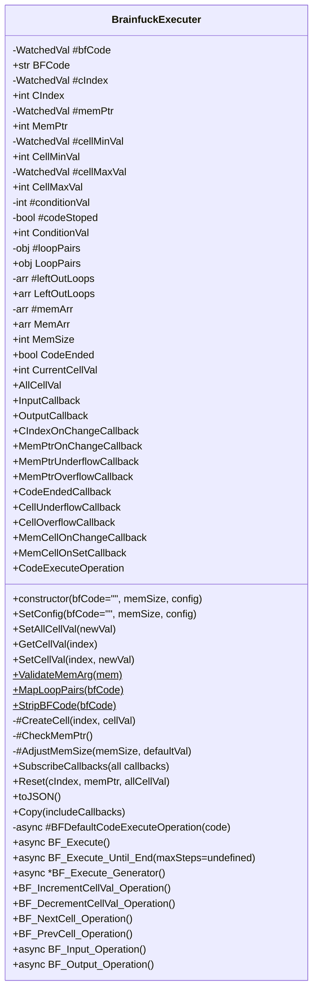

# [BrainfuckExecuter](/src/Executer/BrainfuckExecuter.js)

This class should and will only execute brainfuck. Can be interact with using callbacks.



## Constants

## BFMemoryMaxSize

* Value is 30000.
* The maximum cell a `BrainfuckExecuter` can have.

## Private Properties

### #bfCode

* Private `WatchedVal` type string.
* Stores the brainfuck code to be, or already, executed.
* Default to empty string (`""`).
* When the value changes, *[loop pairs](#looppairs-1)* and *[left-out loops](#leftoutloops-1)* will be remaped.
* Changing this will **not** change the CIndex.
* Exposed by [`BFCode`](#bfcode-1) with getter and setter.

### #cIndex

* Private `WatchedVal` type integer.
* This index points to the current code to be executed.
* The value can be any integer, not limited within 0 and [`BFCode`](#bfcode).
* Default to 0.
* When the value changes, [`CIndexOnChangeCallback`](#cindexonchangecallback) will be called, and if it is larger or equal to [`BFCode`](#bfcode), [`CodeEndedCallback`](#codeendedcallback) will be called.
* Will be affected by [`BF_Execute`](#bf_execute), which is the return value of [`CodeExecuteOperation`](#codeexecuteoperation), if that callback is provided.
* Exposed by [`CIndex`](#cindex-1) with getter and setter.

### #memPtr

* Private `WatchedVal` type integer.
* This points to the current cell in [`#memArr`](#memarr).
* Limited by the [`MemSize`](#memsize).
* Default to 0.
* When the value changes, [`MemPtrOnChangeCallback`](#memptronchangecallback) will be called, and if it is underflowed (smaller than 0) or overflowed (larger or equal to [`MemSize`](#memsize)), [`MemPtrUnderflowCallback`](#memptrunderflowcallback) or [`MemPtrOverflowCallback`](#memptroverflowcallback) will be called respectively.
* Will be affected by [`BF_NextCell_Operation`](#bf_nextcell_operation) and [`BF_PrevCell_Operation`](#bf_prevcell_operation).
* When be affected when [`MemArr`](#memarr-1) and [`MemSize`](#memsize) changes.
* Exposed by [`MemPtr`](#memptr-1) with getter and setter.

### #cellMinVal

* Private `WatchedVal` type integer.
* This is the min boundary of cells in [`#memArr`](#memarr) (inclusive).
* This property is for custom Brainfuck behaviour.
* Value is not limited, but must be smaller or equal to [`CellMaxVal`](#cellmaxval-1).
* Default to 0.
* When the value changes, the min of **all** cells in [`#memArr`](#memarr) will be changed, which might changes the value of each cell, and if the new value underflowed, overflowed, or changed, [`CellUnderflowCallback`](#cellunderflowcallback), [`CellOverflowCallback`](#celloverflowcallback), and [`MemCellOnChangeCallback`](#memcellonchangecallback) will be called respectively.
* This property, with [`#cellMaxVal`](#cellmaxval), [`AllCelVal`](#allcellval), and [`SetAllCellVal`](#setallcellval) are the only members that will affect every cells in [`#memArr`](#memarr).
* Brainfuck execution operations will not affect this property.
* Exposed by [`CellMinVal`](#cellminval-1) with getter and setter.
* Please ensure that [`ConditionVal`](#conditionval-1) is the correct intended value, or it might cause infinite loop.

### #cellMaxVal

* Private `WatchedVal` type integer.
* This is the max boundary of cells in [`#memArr`](#memarr) (inclusive).
* This property is for custom Brainfuck behaviour.
* Value is not limited, but must be larger or equal to [`CellMinVal`](#cellminval-1).
* Default to 255.
* When the value changes, the max of **all** cells in [`#memArr`](#memarr) will be changed, which might changes the value of each cell, and if the new value underflowed, overflowed, or changed, [`CellUnderflowCallback`](#cellunderflowcallback), [`CellOverflowCallback`](#celloverflowcallback), and [`MemCellOnChangeCallback`](#memcellonchangecallback) will be called respectively.
* This property, with [`#cellMinVal`](#cellminval), [`AllCelVal`](#allcellval), and [`SetAllCellVal`](#setallcellval) are the only members that will affect every cells in [`#memArr`](#memarr).
* Brainfuck execution operations will not affect this property.
* Exposed by [`CellMaxVal`](#cellmaxval-1) with getter and setter.
* Please ensure that [`ConditionVal`](#conditionval-1) is the correct intended value, or it might cause infinite loop.

### #conditionVal

* Private integer.
* This is the condition value, used in loop checking in [`#BFDefaultCodeExecuteOperation`](#bfdefaultcodeexecuteoperation).
* Default to 0.
* The value is not limited, as long as it is an integer.
* The changing of this property will not affect anything, except how loop will behave in [`#BFDefaultCodeExecuteOperation`](#bfdefaultcodeexecuteoperation).
* Brainfuck execution operations will not affect this property.
* Exposed by [`ConditionVal`](#conditionval-1) with getter and setter.
* The reason I didn't throw error for out-of-range conditionVal is because it will increase the complexity when setting [`CellMinVal`](#cellminval-1) and [`CellMaxVal`](#cellmaxval-1).
* In other word, this is a feature to allow never ending loop.
* User will need to ensure this value is correct to prevent infinity loop, so be aware when setting [`CellMinVal`](#cellminval-1) and [`CellMaxVal`](#cellmaxval-1).

### #codeStoped

* Private boolean.
* This is the flag indicating if the code stoped or not, reset to false after [`BFCode`](#bfcode-1) is setted.
* Default to false.
* The changing of this property will not affect anything, except the code flow ([`CodeEnded`](#codeended), [`BF_Execute_Generator`](#async-bf_execute_generator) and [`BF_Execute_Until_End`](#async-bf_execute_until_end)).

### #loopPairs

* Private JavaScript object.
* This stores all pairs of *loop heads* (`[`) and *loop tails* (`]`) in [`BFCode`](#bfcode-1) by index (integer), which is where they jump to.
* Bi-directional.
* Default to empty.
* Can only be changed (re-mapped) when [`BFCode`](#bfcode-1) changes.
* The changing of this property will not affect anything, except how loop will behave in [`#BFDefaultCodeExecuteOperation`](#bfdefaultcodeexecuteoperation).
* Brainfuck execution operations will not affect this property.
* Exposed by [`LoopPairs`](#looppairs-1) with getter **only** (can't be setted).

### #leftOutLoops

* Private array of integers.
* This stores the index (integer) of all *loop heads* (`[`) and *loop tails* (`]`) without it's pair of *tail* and *head* respectively.
* Default to empty.
* Can only be changed (re-mapped) when [`BFCode`](#bfcode-1) changes.
* The changing of this property will not affect anything, this is not even used within the class.
* Brainfuck execution operations will not affect this property.
* Exposed by [`LeftOutLoops`](#leftoutloops-1) with getter **only** (can't be setted).

### #memArr

* Private array of `WrappedInt`.
* This is the memory, with all the cells.
* Default to empty, but will have at least one cell when object is constructed.
* After object constructed, should have length between 1 and [`BFMemoryMaxSize`](#bfmemorymaxsize).
* Can only change the length, and when changed, will affect [`MemPtr`](#memptr-1).
* Can be changed by [`MemSize`](#memsize) and [`#AdjustMemSize`](#adjustmemsize), which will trim or extend the array.
* After changes, if [`MemPtr`](#memptr-1) is underflowed or overflowed, [`MemPtrUnderflowCallback`](#memptrunderflowcallback) or [`MemPtrOverflowCallback`](#memptroverflowcallback) will be called respectively.
* Will affect the maximum value of [`MemPtr`](#memptr-1).
* Brainfuck execution operations will not affect this property.
* Exposed by [`MemArr`](#memarr-1) with getter and setter, which getter will only return the value of each cell.

## Public Properties

### BFCode

* Public string.
* The getter and setter of [`bfCode`](#bfcode).

* Get BFCode

* Set BFCode

### CIndex

* Public integer.
* The getter and setter of [`#cIndex`](#cindex).

* Get CIndex

* Set CIndex

### MemPtr

* Public integer.
* The getter and setter of [`#memPtr`](#memptr).

* Get MemPtr

* Set MemPtr

### CellMinVal

* Public integer.
* The getter and setter of [`#cellMinVal`](#cellminval).

* Get CellMinVal

* Set CellMinVal

### CellMaxVal

* Public integer.
* The getter and setter of [`#cellMaxVal`](#cellmaxval).

* Get CellMaxVal

* Set CellMaxVal

### ConditionVal

* Public integer.
* The getter and setter of [`#conditionVal`](#conditionval).

* Get ConditionVal

* Set ConditionVal

### LoopPairs

* Public JavaScript object.
* The getter of [`#loopPairs`](#looppairs).
* The getter will only return the shallow copy of [`#loopPairs`](#looppairs).

* Get LoopPairs

### LeftOutLoops

* Public array of integers.
* The getter of [`#leftOutLoops`](#leftoutloops).
* The getter will only return the shallow copy of [`#leftOutLoops`](#leftoutloops).

* Get LeftOutLoops

### MemArr

* Public array of integers.
* The getter and setter of [`#memArr`](#memarr).
* The getter will only return the value of cells in [`#memArr`](#memarr), not the `WrappedInt` object.
* The setter will only accept array of integers with length between 1 and [`BFMemoryMaxSize`](#bfmemorymaxsize), the setter will create cells with callbacks with values provided.

* Get MemArr

* Set MemArr

### MemSize

* Public integer.
* The getter and setter that shows and modify the size of memory ([`#memArr`](#memarr)).
* The getter will return the length of [`#memArr`](#memarr).
* The setter will trim or extend [`#memArr`](#memarr).
* When triming, will remove last few extra cells.
* When extending [`#memArr`](#memarr), will create cells with [`CellMinVal`](#cellminval-1) as value.
* The value should be in between 1 and [`BFMemoryMaxSize`](#bfmemorymaxsize).

* Get MemSize

* Set MemSize

### CodeEnded

* Public boolean.
* The getter that shows if the code execution is ended, i.e., no more character in [`BFCode`](#bfcode-1) pointed by [`CIndex`](#cindex-1) to execute or [`#codeStoped`](#codestoped) is true.
* The setter to stop the code execution.

* Get CodeEnded

* Set CodeEnded

### CurrentCellVal

* Public integer.
* The getter and setter to get and set the value of the cell pointed by [`MemPtr`](#memptr-1) in [`#memArr`](#memarr).
* The getter will only return the value of the cell, not the `WrappedInt` object.

* Get CurrentCellVal

* Set CurrentCellVal

### AllCellVal

* Public integer.
* The setter to set the value of all cells in [`#memArr`](#memarr).
* This might change the value of many cells, which, same as [`CellMinVal`](#cellminval-1) and [`CellMaxVal`](#cellmaxval-1), might trigger callbacks.
* No getter.

* Set AllCellVal

## Callbacks

### InputCallback

* Argument:
  * brainfuckExecuter: The current object.
* Return:
  * The integer input value or a `Promise` of that, how the input is converted or interpreted to integer is depends on the user.
* Default to return [`CellMinVal`](#cellminval-1).
* Will be called for input in [`#BFDefaultCodeExecuteOperation`](#bfdefaultcodeexecuteoperation) and [`BF_Input_Operation`](#bf_input_operation).
* Can be `async`.

### OutputCallback

* Argument:
  * output: The integer output, how the output is converted or interpreted from integer is depends on the user.
  * brainfuckExecuter: The current object.
* Will be called for ouptut in [`#BFDefaultCodeExecuteOperation`](#bfdefaultcodeexecuteoperation) and [`BF_Output_Operation`](#bf_output_operation).
* Can be `async`.

### CIndexOnChangeCallback

* Arguments:
  * oldVal: The original [`CIndex`](#cindex-1) value, integer.
  * newVal: The new changed [`CIndex`](#cindex-1) value, integer.
  * brainfuckExecuterAfter: The current object after the changes.
* Will be called when [`CIndex`](#cindex-1) changes.

### MemPtrOnChangeCallback

* Arguments:
  * oldVal: The original [`MemPtr`](#memptr-1) value, integer.
  * newVal: The new changed [`MemPtr`](#memptr-1) value, integer.
  * brainfuckExecuterAfter: The current object after the changes.
* Will be called when [`MemPtr`](#memptr-1) changes.

### MemPtrUnderflowCallback

* Arguments:
  * val: The underflowed value, integer.
  * brainfuckExecuter: The current object.
* Default to throw `MemPtrOutOfRangeError`.
* Will be called when [`MemPtr`](#memptr-1) is underflowed (smaller than 0).

### MemPtrOverflowCallback

* Arguments:
  * val: The overflowed value, integer.
  * brainfuckExecuter: The current object.
* Default to throw `MemPtrOutOfRangeError`.
* Will be called when [`MemPtr`](#memptr-1) is overflowed (larger or equal to [`MemSize`](#memsize)).

### CodeEndedCallback

* Arguments:
  * brainfuckExecuter: The current object.
* Will be called when the code is ended, i.e., [`CIndex`](#cindex-1) is larger or equal to the length of [`BFCode`](#bfcode-1).
* Will not be called when code is stoped, i.e., [`#codeStoped`](#codestoped) is true.

### CellUnderflowCallback

* Arguments:
  * index: The index of cell that underflowed, integer.
  * valBefore: The original value of cell, integer.
  * valAfter: The wrapped value of cell, integer.
  * brainfuckExecuterAfter: The current object.
* Will be called when the cell value underflowed, i.e., smaller than [`CellMinVal`](#cellminval-1).

### CellOverflowCallback

* Arguments:
  * index: The index of cell that overflowed, integer.
  * valBefore: The original value of cell, integer.
  * valAfter: The wrapped value of cell, integer.
  * brainfuckExecuterAfter: The current object.
* Will be called when the cell value overflowed, i.e., larger than [`CellMaxVal`](#cellmaxval-1).

### MemCellOnChangeCallback

* Arguments:
  * index: The index of cell that value was changed, integer.
  * oldVal: The original value of cell, integer.
  * newVal: The new value of cell after changes, integer.
  * brainfuckExecuterAfter: The current object.
* Will be called when the cell value changes.
* Will be called after [`CellUnderflowCallback`](#cellunderflowcallback) and [`CellOverflowCalback`](#celloverflowcallback), if those are called.
* Please note that a cell underflowed or overflowed doesn't necessary change the value (wrapped into the same value), therefore not necessary call this callback.

### MemCellOnSetCallback

* Arguments:
  * index: The index of cell that value was setted, integer.
  * val: The value of cell, integer.
  * brainfuckExecuterAfter: The current object.
* Will be called when the cell value is setted.
* Will be called after [`CellUnderflowCallback`](#cellunderflowcallback), [`CellOverflowCalback`](#celloverflowcallback), and [`MemCellOnChangeCallback`](#memcellonchangecallback), if those are called.
* This will be called even if the value is not changed, underflowed, or overflowed.

### CodeExecuteOperation

* Arguments:
  * code: The current code character in [`BFCode`](#bfcode-1) pointed by [`CIndex`](#cindex-1).
  * brainfuckExecuter: The current object.
* Return:
  * The next cIndex, integer.
* To override the default Brainfuck execution, [`#BFDefaultCodeExecuteOperation`](#bfdefaultcodeexecuteoperation), in [`BF_Execute`](#bf_execute).
* If this is `undefined`, then [`BF_Execute`](#bf_execute) will use the default [`#BFDefaultCodeExecuteOperation`](#bfdefaultcodeexecuteoperation).
* Can be `async`.

## Static Methods

### ValidateMemArg

* Arguments:
  * mem: The array of integers (memory) to be validated.
* Validate and ensure that all values in `mem` are integers.
* Will not return anything, instead, it will raise an `CustomTypeError` when a non-integer value encountered.

### MapLoopPairs

* Arguments:
  * bfCode: The Brainfuck code to map.
* Return:
  * JavaScript object containing *loop-pairs* (bi-directional) and *left-out loops*, as shown below:
    ```JavaScript
        LoopPairs: {
            integer: integer
        },
        LeftOutLoops: [integers]
    ```
    * LoopPairs: A JavaScript object with both key and value are integers, bi-directional.
    * LeftOutLoops: The index of left-out, unpaired heads and tails.
* Map the *loop-pairs* (`[`) and *left-out loops* (`]`).

### StripBFCode

* Arguments:
  * bfCode: The Brainfuck code to strip.
* Return:
  * The stripped Brainfuck code.
* Strip the Brainfuck code, remove all non Brainfuck characters.

## Private Methods

### #CreateCell

* Arguments:
  * index: The index of the new cell. This is required for the callbacks.
  * cellVal: The value of the create cell.
* Return:
  * The created `WrappedInt` cell.
* Create new `WrappedInt` cell, used when setting [`MemArr`](#memarr-1), [`MemSize`](#memsize), and [`#AdjustMemSize`](#adjustmemsize).

### #CheckMemPtr

* Return:
  * Boolean, `true` if [`MemPtr`](#memptr-1) is within [`CellMinVal`](#cellminval-1) and [`CellMaxVal`](#cellmaxval-1), `false` otherwise.
* Check if [`MemPtr`](#memptr-1) is within [`CellMinVal`](#cellminval-1) and [`CellMaxVal`](#cellmaxval-1).
* Will call [`MemPtrUnderflowCallback`](#memptrunderflowcallback) if [`MemPtr`](#memptr-1) is smaller than [`CellMinVal`](#cellminval-1), [`MemPtrOverflowCallback`](#memptroverflowcallback) if [`MemPtr`](#memptr-1) is larger than [`CellMaxVal`](#cellmaxval-1).

### #AdjustMemSize

* Arguments:
  * memSize: The intended size of [`#memArr`](#memarr).
  * defaultVal: The value used to create new `WrappedInt` when extending.
* Extend or trim [`#memArr`](#memarr) based on the given `memSize`.
* Will create new `WrappedInt` with `defaultVal` when extending. If `defaultVal` is not provided, will use [`CellMinVal`](#cellminval-1).
* Will remove the last extra cells (`WrappedInt`) when trimming.

### async #BFDefaultCodeExecuteOperation

* Arguments:
  * code: The code character to execute.
* Return:
  * The next `cIndex`, integer.
* The default execution, basically how brainfuck execution should behave.
* If loop head and tail is not in [`#LoopPairs`](#looppairs-1), it will be skipped.
* Will `await` for [`BF_Input_Operation`](#async-bf_input_operation) and [`BF_Output_Operation`](#async-bf_output_operation), if performed.

## Public Methods

### constructor

* Arguments:
  * bfCode: The Brainfuck code string, defaults to empty string (`""`).
  * memSize: The size (integer) of memory, defaults to 30000.
  * config: All other configs:
    * cIndex
    * memPtr
    * mem
    * cellMinVal
    * cellMaxVal
    * conditionVal
    * defaultVal
    * inputCallback
    * outputCallback
    * cIndexOnChangeCallback
    * memPtrOnChangeCallback
    * memPtrUnderflowCallback
    * memPtrOverflowCallback
    * codeEndedCallback
    * cellUnderflowCallback
    * cellOverflowCallback
    * memCellOnChangeCallback
    * memCellOnSetCallback
    * codeExecuteOperation

### SetConfig

* Arguments:
  * bfCode: The Brainfuck code string, defaults to empty string (`""`).
  * memSize: The size (integer) of memory, defaults to 30000.
  * config: All other configs:
    * cIndex
    * memPtr
    * mem
    * cellMinVal
    * cellMaxVal
    * conditionVal
    * defaultVal
    * inputCallback
    * outputCallback
    * cIndexOnChangeCallback
    * memPtrOnChangeCallback
    * memPtrUnderflowCallback
    * memPtrOverflowCallback
    * codeEndedCallback
    * cellUnderflowCallback
    * cellOverflowCallback
    * memCellOnChangeCallback
    * memCellOnSetCallback
    * codeExecuteOperation
* Return:
  * Current object
* To setup or change the properties and callbacks.

### GetCellVal

* Arguments:
  * index: The index (integer) of cell to get value.
* Return:
  * The integer value of the cell.
* To get the value of certain cell in [`#memArr`](#memarr).

### SetCellVal

* Arguments:
  * index: The index (integer) of cell to set value.
  * newVal: The new integer value to set for cell.
* To set the value of certain cell in [`#memArr`](#memarr).

### SetAllCellVal

* Arguments:
  * newVal: The new integer value to set for all cells.
* To set the value of all cells in [`#memArr`](#memarr).

### SubscribeCallbacks

* Arguments:
  * inputCallback
  * outputCallback
  * cIndexOnChangeCallback
  * memPtrOnChangeCallback
  * memPtrUnderflowCallback
  * memPtrOverflowCallback
  * codeEndedCallback
  * cellUnderflowCallback
  * cellOverflowCallback
  * memCellOnChangeCallback
  * memCellOnSetCallback
  * codeExecuteOperation
* Return:
  * Current object.
* To set or change the [callbacks](#callbacks).

### Reset

* Return:
  * Current object.
* Reset the `BrainfuckExecuter` to the initial state.
* If `cIndex`, `memPtr`, or `allCellVal` is not provided, it will be set to 0, 0, and [`CellMinVal`](#cellminval-1) respectively.

### async BF_Execute

* Return:
  * Current object.
* Execute current code with provided [`CodeExecuteOperation`](#codeexecuteoperation) or default [`#BFDefaultCodeExecuteOperation`](#bfdefaultcodeexecuteoperation), if [`CIndex`](#cindex-1) is still within [`BFCode`](#bfcode).
* Will only execute once.
* Will `await` for [`#BFDefaultCodeExecuteOperation`](#async-bfdefaultcodeexecuteoperation).

### async BF_Execute_Until_End

* Arguments:
  * maxSteps: The maximum step or iteration to run [`BF_Execute`](#async-bf_execute).
* Return:
  * Current object.
* Run [`BF_Execute`](#async-bf_execute) until end (until [`CodeEnded`](#codeended) is `true`) or until `maxSteps`.

### async *BF_Execute_Generator

* Return:
  * Current object.
* Create a generator to run [`BF_Execute`](#async-bf_execute) until end (until [`CodeEnded`](#codeended) is `true`).

### BF_IncrementCellVal_Operation

* Return:
  * Current object.
* Perform `+` operation.

### BF_DecrementCellVal_Operation

* Return:
  * Current object.
* Perform `-` operation.

### BF_NextCell_Operation

* Return:
  * Current object.
* Perform `>` operation.

### BF_PrevCell_Operation

* Return:
  * Current object.
* Perform `<` operation.

### async BF_Input_Operation

* Return:
  * Current object.
* Perform `.` operation by calling and `await` [`InputCallback`](#inputcallback).

### async BF_Output_Operation

* Return:
  * Current object.
* Perform `,` operation by calling and `await` [`OutputCallback`](#outputcallback).

### toJSON

* Return:
  * The JSON representation of current object, with these values:
    * BFCode: String
    * CIndex: Integer
    * MemPtr: Integer
    * MemSize: Integer
    * MemArr: Array of integers
    * CodeEnded: Boolean
    * CellMinVal: Integer
    * CellMaxVal: Integer
    * ConditionVal: Integer
    * LoopPairs: JavaScript object
    * LeftOutLoops: Array of integers
* Return the JSON representation of current object.

### Copy

* Arguments:
  * includeCallbacks: To also copy the [callbacks](#callbacks).
* Return:
  * The copied `BrainfuckExecuter` object.
* Create a copy of current object.
