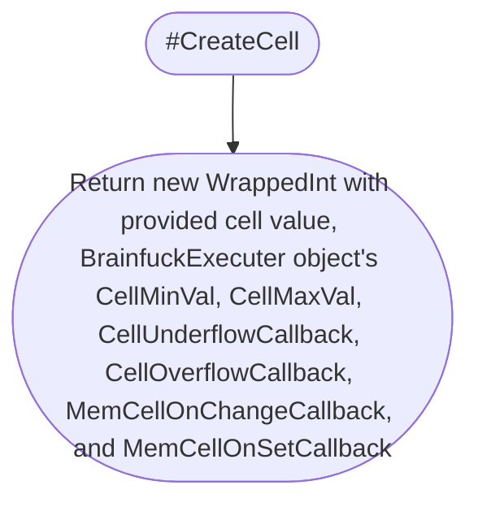

# [BrainfuckExecuter](./src/Executer/BrainfuckExecuter.js)


## Private Properties

### #bfCode

### #cIndex

### #memPtr

### #cellMinVal

### #cellMaxVal

### #conditionVal

### #loopPairs

### #leftOutLoops

### #memArr

## Public Properties

### BFCode

* Get BFCode

* Set BFCode
    ```mermaid
    flowchart TD

    subgraph WatchedVal
        SetBFCode[#bfCode.Val = newVal]
        WatchedValCheckSameVal{originalVal === newVal}
    end

    subgraph BrainfuckExecuter
        Start([Set BFCode])
        EnsureString
        MapLoopPairs[mapResult = MapLoopPairs]
        SetLoopPairs[#loopPairs = mapResult.LoopPairs]
        SetLeftOutLoops[#leftOutLoops = mapResult.LeftOutLoops]
        End([End])
    end

    Start
    -->
    EnsureString
    -->
    SetBFCode
    -->
    WatchedValCheckSameVal
    --false-->
    MapLoopPairs
    -->
    SetLoopPairs
    -->
    SetLeftOutLoops
    -->
    End

    WatchedValCheckSameVal
    --true-->
    End
    ```

### CIndex

* Get CIndex

* Set CIndex
    ```mermaid
    flowchart TD

    subgraph WatchedVal
        SetCIndex[#cIndex.Val = newVal]
        WatchedValCheckSameVal{originalVal === newVal}
    end

    subgraph BrainfuckExecuter
        Start([Set CIndex])
        EnsureInt
        EnsureInRange[Ensure 0 <= newVal < BFCode.length]
        CIndexOnChangeCallback
        IsCodeEnded{CodeEnded === true}
        CodeEndedCallback
        End([End])
    end

    Start
    -->
    EnsureInt
    -->
    EnsureInRange
    -->
    SetCIndex
    -->
    WatchedValCheckSameVal
    --false-->
    CIndexOnChangeCallback
    -->
    IsCodeEnded
    --true-->
    CodeEndedCallback
    -->
    End

    WatchedValCheckSameVal
    --true-->
    End

    IsCodeEnded
    --false-->
    End
    ```

### MemPtr

* Get MemPtr

* Set MemPtr
    ```mermaid
    flowchart TD

    subgraph WatchedVal
        SetMemPtr[#memPtr.Val = newVal]
        WatchedValCheckSameVal{originalVal === newVal}
    end

    subgraph BrainfuckExecuter
        Start([Set MemPtr])
        EnsureInt
        MemPtrOnChangeCallback
        CheckMemPtr
        End([End])
    end

    Start
    -->
    EnsureInt
    -->
    SetMemPtr
    -->
    WatchedValCheckSameVal
    --false-->
    MemPtrOnChangeCallback
    -->
    CheckMemPtr
    -->
    End
    
    WatchedValCheckSameVal
    --true-->
    End
    ```

### CellMinVal

* Get CellMinVal

* Set CellMinVal
    ```mermaid
    flowchart TD

    subgraph WatchedVal
        SetCellMinVal[#cellMinVal.Val = newVal]
        WatchedValCheckSameVal{originalVal === newVal}
    end

    subgraph WrappedInt
        WrappedIntEnsureInt[Ensure newVal is int]
        WrappedIntEnsureIntValMinMax[Ensure all val, min, and max are int]
        WrappedIntEnsureMinMax1[EnsureMinMax]
        WrappedIntEnsureMinMax2[EnsureMinMax]
        SetIndCellMin[Cell.Min = newVal]
        CheckUnderflow[Flag val < min as underflow]
        CheckOverflow[Flag val > max as overflow]
        Wrap
        WasUnderflow{Was underflow}
        WasOverflow{Was overflow}
        WrappedIntValChanged{val changed?}
    end

    subgraph BrainfuckExecuter
        Start([Set CellMinVal])
        BrainfuckExecuterEnsureInt[Ensure newVal is int]
        BrainfuckExecuterEnsureMinMax[EnsureMinMax]
        ForAllCell{For Cell in #memArr}
        UnderflowCallback
        OverflowCallback
        ValOnChangeCallback
        End([End])
    end

    Start
    -->
    BrainfuckExecuterEnsureInt
    -->
    BrainfuckExecuterEnsureMinMax
    -->
    SetCellMinVal
    -->
    WatchedValCheckSameVal
    --false-->
    ForAllCell
    --Cell-->
    SetIndCellMin
    -->
    WrappedIntEnsureInt
    -->
    WrappedIntEnsureMinMax1
    -->
    CheckUnderflow
    -->
    CheckOverflow
    -->
    WrappedIntEnsureIntValMinMax
    -->
    WrappedIntEnsureMinMax2
    -->
    Wrap
    -->
    WasUnderflow
    --true-->
    UnderflowCallback
    -->
    WasOverflow
    --true-->
    OverflowCallback
    -->
    WrappedIntValChanged
    --true-->
    ValOnChangeCallback
    -->
    ForAllCell
    --End of #memArr-->
    End

    WatchedValCheckSameVal
    --true-->
    End

    WasUnderflow
    --false-->
    WasOverflow
    --false-->
    WrappedIntValChanged
    --false-->
    ForAllCell
    ```

### CellMaxVal

* Get CellMaxVal

* Set CellMaxVal
    ```mermaid
    flowchart TD

    subgraph WatchedVal
        SetCellMaxVal[#cellMaxVal.Val = newVal]
        WatchedValCheckSameVal{originalVal === newVal}
    end

    subgraph WrappedInt
        WrappedIntEnsureInt[Ensure newVal is int]
        WrappedIntEnsureIntValMinMax[Ensure all val, min, and max are int]
        WrappedIntEnsureMinMax1[EnsureMinMax]
        WrappedIntEnsureMinMax2[EnsureMinMax]
        SetIndCellMax[Cell.Max = newVal]
        CheckUnderflow[Flag val < min as underflow]
        CheckOverflow[Flag val > max as overflow]
        Wrap
        WasUnderflow{Was underflow}
        WasOverflow{Was overflow}
        WrappedIntValChanged{val changed?}
    end

    subgraph BrainfuckExecuter
        Start([Set CellMaxVal])
        BrainfuckExecuterEnsureInt[Ensure newVal is int]
        BrainfuckExecuterEnsureMinMax[EnsureMinMax]
        ForAllCell{For Cell in #memArr}
        UnderflowCallback
        OverflowCallback
        ValOnChangeCallback
        End([End])
    end

    Start
    -->
    BrainfuckExecuterEnsureInt
    -->
    BrainfuckExecuterEnsureMinMax
    -->
    SetCellMaxVal
    -->
    WatchedValCheckSameVal
    --false-->
    ForAllCell
    --Cell-->
    SetIndCellMax
    -->
    WrappedIntEnsureInt
    -->
    WrappedIntEnsureMinMax1
    -->
    CheckUnderflow
    -->
    CheckOverflow
    -->
    WrappedIntEnsureIntValMinMax
    -->
    WrappedIntEnsureMinMax2
    -->
    Wrap
    -->
    WasUnderflow
    --true-->
    UnderflowCallback
    -->
    WasOverflow
    --true-->
    OverflowCallback
    -->
    WrappedIntValChanged
    --true-->
    ValOnChangeCallback
    -->
    ForAllCell
    --End of #memArr-->
    End

    WatchedValCheckSameVal
    --true-->
    End

    WasUnderflow
    --false-->
    WasOverflow
    --false-->
    WrappedIntValChanged
    --false-->
    ForAllCell
    ```

### ConditionVal

* Get ConditionVal

* Set ConditionVal
    ```mermaid
    flowchart TD

    Start([Set ConditionVal])
    EnsureInt
    EnsureInRange[Ensure CellMinVal <= newVal <= CellMaxVal]
    SetConditionVal[#conditionVal = newVal]
    End([End])

    Start
    -->
    EnsureInt
    -->
    EnsureInRange
    -->
    SetConditionVal
    -->
    End
    ```

### LoopPairs

* Get LoopPairs

### LeftOutLoops

* Get LeftOutLoops

### MemArr

* Get MemArr

* Set MemArr
    ```mermaid
    flowchart TD

    Start([Set MemArr])
    ValidateMemArg
    InitializeMemArr[#memArr = empty array]
    ForCond{For i in newMem.length}
    CreateCell
    PushToMemArr[#memArr.push new cell]
    CheckMemPtr
    End([End])

    Start
    -->
    ValidateMemArg
    -->
    InitializeMemArr
    -->
    ForCond
    --i-->
    CreateCell
    -->
    PushToMemArr
    -->
    ForCond
    --loop ended-->
    CheckMemPtr
    -->
    End
    ```

### MemSize

* Get MemSize

* Set MemSize
    ```mermaid
    flowchart TD

    Start([Set MemSize])
    AdjustMemSize[#AdjustMemSize]
    End([End])

    Start
    -->
    AdjustMemSize
    -->
    End
    ```

### CodeEnded

* Get CodeEnded

### CurrentCellVal

* Get CurrentCellVal

* Set CurrentCellVal
    ```mermaid
    flowchart TD

    Start([Set CurrentCellVal])
    SetCellVal[SetCellVal with MemPtr and newVal]
    End([End])

    Start
    -->
    SetCellVal
    -->
    End
    ```

## Callbacks

### InputCallback

### OutputCallback

### CIndexOnChangeCallback

### MemPtrOnChangeCallback

### MmePtrUnderflowCallback

### MemPtrOverflowCallback

### CodeEndedCallback

### CellUnderflowCallback

### CellOverflowCallback

### MemCellOnChangeCallback

### MemCellOnSetCallback

### CodeExecuteOperation

## Static Methods

### ValidateMemArg


### MapLoopPairs


## Private Methods

### #CreateCell


### #CheckMemPtr


### #AdjustMemSize


### #BFDefaultCodeExecuteOperation


## Public Methods

### constructor


### SetConfig


### GetCellVal


### SetCellVal


### SubscribeCallbacks


### BF_Execute


### BF_IncrementCellVal_Operation


### BF_DecrementCellVal_Operation


### BF_NextCell_Operation


### BF_PrevCell_Operation


### BF_Input_Operation


### BF_Output_Operation

