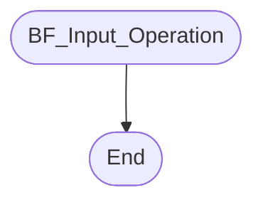

# [BrainfuckExecuter](./src/Executer/BrainfuckExecuter.js)


## Private Properties

### #bfCode

### #cIndex

### #memPtr

### #cellMinVal

### #cellMaxVal

### #conditionVal

### #loopPairs

### #leftOutLoops

### #memArr

## Public Properties

### BFCode

* Get BFCode

* Set BFCode
    ```mermaid
    flowchart

    Start([Set BFCode])
    -->
    EnsureString
    -->
    SetbfCode[Set #bfCode.Val]
    -->
    MapLoopPairs
    -->
    SetLoopPairsLeftOutLoops[
    Set loopPairs
    Set leftOutLoops
    ]
    -->
    CodeEnded{CodeEnded?}
    --true-->
    CodeEndedCallback
    -->
    End([End])
    CodeEnded
    --false-->
    End
    ```

### CIndex

* Get CIndex

* Set CIndex
    ```mermaid
    flowchart

    Start([Set CIndex])
    -->
    EnsureInt
    -->
    EnsureInRange
    -->
    SetcIndex[Set #cIndex.Val]
    -->
    CIndexOnChangeCallback
    -->
    End([End])
    ```

### MemPtr

* Get MemPtr

* Set MemPtr
    ```mermaid
    flowchart

    Start([Set MemPtr])
    -->
    EnsureInt
    -->
    SetmemPtr[Set #memPtr.Val]
    -->
    MemPtrOnChangeCallback
    -->
    SmallerCheck{<0}
    --true-->
    MemPtrUnderflowCallback
    -->
    LargerCheck
    SmallerCheck
    --false--> 
    LargerCheck{>=MemSize}
    --true-->
    MemPtrOverflowCallback
    -->
    End([End])
    LargerCheck
    --false-->
    End
    ```

### CellMinVal

* Get CellMinVal

* Set CellMinVal
    ```mermaid
    flowchart

    Start([Set CellMinVal])
    -->
    EnsureInt
    -->
    EnsureMinMax
    -->
    SetcellMinVal[Set #cellMinVal.Val]
    -->
    LoopCond{for cell in #memArr}
    -->
    SetCellMin[Set cell.Min]
    -->
    LoopCond
    SetCellMin
    -->
    End([End])
    ```

### CellMaxVal

* Get CellMaxVal

* Set CellMaxVal
    ```mermaid
    flowchart

    Start([Set CellMaxVal])
    -->
    EnsureInt
    -->
    EnsureMinMax
    -->
    SetcellMaxVal[Set #cellMaxVal.Val]
    -->
    LoopCond{for cell in #memArr}
    -->
    SetCellMax[Set cell.Max]
    -->
    LoopCond
    SetCellMax
    -->
    End([End])
    ```

### ConditionVal

* Get ConditionVal

* Set ConditionVal
    ```mermaid
    flowchart

    Start([Set ConditionVal])
    -->
    End([End])
    ```

### LoopPairs

* Get LoopPairs

### LeftOutLoops

* Get LeftOutLoops

### MemArr

* Get MemArr

* Set MemArr
    ```mermaid
    flowchart

    Start([Set MemArr])
    -->
    End([End])
    ```

### MemSize

* Get MemSize

* Set MemSize
    ```mermaid
    flowchart

    Start([Set MemSize])
    -->
    End([End])
    ```

### CodeEnded

* Get CodeEnded

### CurrentCellVal

* Get CurrentCellVal

* Set CurrentCellVal
    ```mermaid
    flowchart

    Start([Set CurrentCellVal])
    -->
    End([End])
    ```

## Callbacks

### InputCallback

### OutputCallback

### CIndexOnChangeCallback

### MemPtrOnChangeCallback

### MmePtrUnderflowCallback

### MemPtrOverflowCallback

### CodeEndedCallback

### CellUnderflowCallback

### CellOverflowCallback

### MemCellOnChangeCallback

### MemCellOnSetCallback

### CodeExecuteOperation

## Static Methods

### ValidateMemArg(mem)

### MapLoopPairs(bfCode)

## Private Methods

### #CreateCell


### #AdjustMemSize


### #BFDefaultCodeExecuteOperation


## Public Methods

### Constructor


### SetConfig


### GetCellVal


### SetCellVal


### SubscribeCallbacks


### BF_Execute


### BF_IncrementCellVal_Operation


### BF_DecrementCellVal_Operation


### BF_NextCell_Operation


### BF_PrevCell_Operation


### BF_Input_Operation


### BF_Output_Operation

