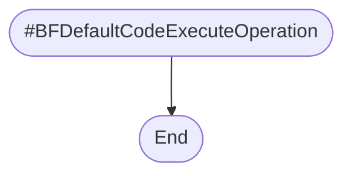
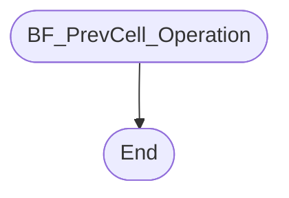

# [BrainfuckExecuter](./src/Executer/BrainfuckExecuter.js)


## Private Properties

### #bfCode

### #cIndex

### #memPtr

### #cellMinVal

### #cellMaxVal

### #conditionVal

### #loopPairs

### #leftOutLoops

### #memArr

## Public Properties

### BFCode

* Get BFCode

* Set BFCode
    ```mermaid
    flowchart
        subgraph WatchedVal
            SetBFCode[#bfCode.Val = newVal]
            WatchedValCheckSameVal{originalVal === newVal}
        end

        subgraph BrainfuckExecuter
            Start([Set BFCode])
            EnsureString
            MapLoopPairs[mapResult = MapLoopPairs]
            SetLoopPairs[#loopPairs = mapResult.LoopPairs]
            SetLeftOutLoops[#leftOutLoops = mapResult.LeftOutLoops]
            End([End])
        end

    Start
    -->
    EnsureString
    -->
    SetBFCode
    -->
    WatchedValCheckSameVal
    --false-->
    MapLoopPairs
    -->
    SetLoopPairs
    -->
    SetLeftOutLoops
    -->
    End

    WatchedValCheckSameVal
    --true-->
    End
    ```

### CIndex

* Get CIndex

* Set CIndex
    ```mermaid
    flowchart
        subgraph WatchedVal
            SetCIndex[#cIndex.Val = newVal]
            WatchedValCheckSameVal{originalVal === newVal}
        end

        subgraph BrainfuckExecuter
            Start([Set CIndex])
            EnsureInt
            EnsureInRange[Ensure 0 <= newVal < BFCode.length]
            CIndexOnChangeCallback
            IsCodeEnded{CodeEnded === true}
            CodeEndedCallback
            End([End])
        end

        Start
        -->
        EnsureInt
        -->
        EnsureInRange
        -->
        SetCIndex
        -->
        WatchedValCheckSameVal
        --false-->
        CIndexOnChangeCallback
        -->
        IsCodeEnded
        --true-->
        CodeEndedCallback
        -->
        End

        WatchedValCheckSameVal
        --true-->
        End

        IsCodeEnded
        --false-->
        End
    ```

### MemPtr

* Get MemPtr

* Set MemPtr
    ```mermaid
    flowchart
        subgraph WatchedVal
            SetMemPtr[#memPtr.Val = newVal]
            WatchedValCheckSameVal{originalVal === newVal}
        end

        subgraph BrainfuckExecuter
            Start([Set MemPtr])
            EnsureInt
            MemPtrOnChangeCallback
            IsNewValUnderflow{newVal < 0}
            MemPtrUnderflowCallback
            IsNewValOverflow{newVal > MemSize}
            MemPtrOverflowCallback
            End([End])
        end

        Start
        -->
        EnsureInt
        -->
        SetMemPtr
        -->
        WatchedValCheckSameVal
        --false-->
        MemPtrOnChangeCallback
        -->
        IsNewValUnderflow
        --true-->
        MemPtrUnderflowCallback
        -->
        IsNewValOverflow
        --true-->
        MemPtrOverflowCallback
        -->
        End
        
        WatchedValCheckSameVal
        --true-->
        End

        IsNewValUnderflow
        --false-->
        IsNewValOverflow
        --false-->
        End
    ```

### CellMinVal

* Get CellMinVal

* Set CellMinVal
    ```mermaid
    flowchart
        subgraph WatchedVal
            SetCellMinVal[#cellMinVal.Val = newVal]
            WatchedValCheckSameVal{originalVal === newVal}
        end

        subgraph WrappedInt
            WrappedIntEnsureInt[Ensure newVal is int]
            WrappedIntEnsureIntValMinMax[Ensure all val, min, and max are int]
            WrappedIntEnsureMinMax1[EnsureMinMax]
            WrappedIntEnsureMinMax2[EnsureMinMax]
            SetIndCellMin[Cell.Min = newVal]
            CheckUnderflow[Flag val < min as underflow]
            CheckOverflow[Flag val > max as overflow]
            Wrap
            WasUnderflow{Was underflow}
            WasOverflow{Was overflow}
            WrappedIntValChanged{val changed?}
        end

        subgraph BrainfuckExecuter
            Start([Set CellMinVal])
            BrainfuckExecuterEnsureInt[Ensure newVal is int]
            BrainfuckExecuterEnsureMinMax[EnsureMinMax]
            ForAllCell{For Cell in #memArr}
            UnderflowCallback
            OverflowCallback
            ValOnChangeCallback
            End([End])
        end

        Start
        -->
        BrainfuckExecuterEnsureInt
        -->
        BrainfuckExecuterEnsureMinMax
        -->
        SetCellMinVal
        -->
        WatchedValCheckSameVal
        --false-->
        ForAllCell
        --Cell-->
        SetIndCellMin
        -->
        WrappedIntEnsureInt
        -->
        WrappedIntEnsureMinMax1
        -->
        CheckUnderflow
        -->
        CheckOverflow
        -->
        WrappedIntEnsureIntValMinMax
        -->
        WrappedIntEnsureMinMax2
        -->
        Wrap
        -->
        WasUnderflow
        --true-->
        UnderflowCallback
        -->
        WasOverflow
        --true-->
        OverflowCallback
        -->
        WrappedIntValChanged
        --true-->
        ValOnChangeCallback
        -->
        ForAllCell
        --End of #memArr-->
        End

        WatchedValCheckSameVal
        --true-->
        End

        WasUnderflow
        --false-->
        WasOverflow
        --false-->
        WrappedIntValChanged
        --false-->
        ForAllCell
    ```

### CellMaxVal

* Get CellMaxVal

* Set CellMaxVal
    ```mermaid
    flowchart
        subgraph WatchedVal
            SetCellMaxVal[#cellMaxVal.Val = newVal]
            WatchedValCheckSameVal{originalVal === newVal}
        end

        subgraph WrappedInt
            WrappedIntEnsureInt[Ensure newVal is int]
            WrappedIntEnsureIntValMinMax[Ensure all val, min, and max are int]
            WrappedIntEnsureMinMax1[EnsureMinMax]
            WrappedIntEnsureMinMax2[EnsureMinMax]
            SetIndCellMax[Cell.Max = newVal]
            CheckUnderflow[Flag val < min as underflow]
            CheckOverflow[Flag val > max as overflow]
            Wrap
            WasUnderflow{Was underflow}
            WasOverflow{Was overflow}
            WrappedIntValChanged{val changed?}
        end

        subgraph BrainfuckExecuter
            Start([Set CellMaxVal])
            BrainfuckExecuterEnsureInt[Ensure newVal is int]
            BrainfuckExecuterEnsureMinMax[EnsureMinMax]
            ForAllCell{For Cell in #memArr}
            UnderflowCallback
            OverflowCallback
            ValOnChangeCallback
            End([End])
        end

        Start
        -->
        BrainfuckExecuterEnsureInt
        -->
        BrainfuckExecuterEnsureMinMax
        -->
        SetCellMaxVal
        -->
        WatchedValCheckSameVal
        --false-->
        ForAllCell
        --Cell-->
        SetIndCellMax
        -->
        WrappedIntEnsureInt
        -->
        WrappedIntEnsureMinMax1
        -->
        CheckUnderflow
        -->
        CheckOverflow
        -->
        WrappedIntEnsureIntValMinMax
        -->
        WrappedIntEnsureMinMax2
        -->
        Wrap
        -->
        WasUnderflow
        --true-->
        UnderflowCallback
        -->
        WasOverflow
        --true-->
        OverflowCallback
        -->
        WrappedIntValChanged
        --true-->
        ValOnChangeCallback
        -->
        ForAllCell
        --End of #memArr-->
        End

        WatchedValCheckSameVal
        --true-->
        End

        WasUnderflow
        --false-->
        WasOverflow
        --false-->
        WrappedIntValChanged
        --false-->
        ForAllCell
    ```

### ConditionVal

* Get ConditionVal

* Set ConditionVal
    ```mermaid
    flowchart

    Start([Set ConditionVal])
    -->
    End([End])
    ```

### LoopPairs

* Get LoopPairs

### LeftOutLoops

* Get LeftOutLoops

### MemArr

* Get MemArr

* Set MemArr
    ```mermaid
    flowchart

    Start([Set MemArr])
    -->
    End([End])
    ```

### MemSize

* Get MemSize

* Set MemSize
    ```mermaid
    flowchart

    Start([Set MemSize])
    -->
    End([End])
    ```

### CodeEnded

* Get CodeEnded

### CurrentCellVal

* Get CurrentCellVal

* Set CurrentCellVal
    ```mermaid
    flowchart

    Start([Set CurrentCellVal])
    -->
    End([End])
    ```

## Callbacks

### InputCallback

### OutputCallback

### CIndexOnChangeCallback

### MemPtrOnChangeCallback

### MmePtrUnderflowCallback

### MemPtrOverflowCallback

### CodeEndedCallback

### CellUnderflowCallback

### CellOverflowCallback

### MemCellOnChangeCallback

### MemCellOnSetCallback

### CodeExecuteOperation

## Static Methods

### ValidateMemArg(mem)

### MapLoopPairs(bfCode)

## Private Methods

### #CreateCell


### #AdjustMemSize


### #BFDefaultCodeExecuteOperation


## Public Methods

### Constructor


### SetConfig


### GetCellVal


### SetCellVal


### SubscribeCallbacks


### BF_Execute


### BF_IncrementCellVal_Operation


### BF_DecrementCellVal_Operation


### BF_NextCell_Operation


### BF_PrevCell_Operation


### BF_Input_Operation


### BF_Output_Operation

